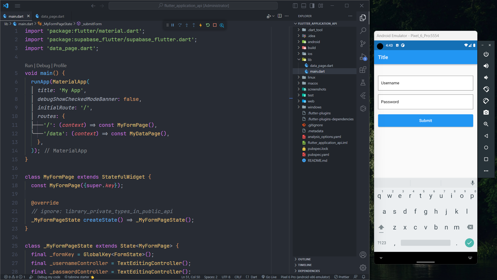

# Flutter Supabase API

Simple insert and fetch data flutter using the Database API from Supabase.

## Tutorial

- Go to website [Supabase](https://supabase.com/) and create an account

- Create a new project within the Organization that you have created

- Create a new database and one table

- The fields of the table are as follows:

| Name | Type     | Length                | Description|
| :-------- | :------- | :------------------------- | ------|
| `id` | `int` | `11` | `Primary`
| `username` | `varchar` | `255` | `-`
| `password` | `varchar` | `255` | `-`

- Download the flutter code and do some configuration on `API URL`, `API KEY` and table name

- To get the `API URL` and `API KEY`, you can enter the Project Settings in the Supabase dashboard menu then select API
## Note

I've commented out the code where you should put the `API URL`, `API KEY` and table name. 👌

## Screenshots

